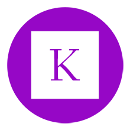

# Kalle



Android platform's Http client.  
* Form submissions, such as text form and file form
* Custom RequestBody, such as files, json and xml
* Support SSL, can customize the certificate
* Multiple cache modes, using AES to encrypt cached data
* Manage cookies like browsers automatically
* Cancel the request at any time
* Global converter, obtain JavaBean from server
* We can choose URLConnection or OkHttp handle socket

```java
Kalle.get("http://www.example.com/user")
    .param("uid", "123")
    .perform(new SimpleCallback<User>(this) {
        @Override
        public void onResponse(SimpleResponse<User, String> response) {
           if(response.isSucceed()) {
              User user = respon.succeed();
           } else {
              Toast.show(response.failed());
           }
        }
    });
```
For documentation and additional information see [the website](https://www.yanzhenjie.com/Kalle).

## Download
Kalle uses URLConnection handle socket by default, add this dependency using Gradle:  
```groovy
implementation 'com.yanzhenjie:kalle:0.1.5'
```

If you want to use okhttp handle socket, add this dependency using Gradle:  
```groovy
implementation 'com.yanzhenjie:okalle:0.1.5'
```

Kalle requires at minimum Android 2.3(Api level 9).

## Contributing
Before submitting pull requests, contributors must abide by the [agreement](CONTRIBUTING.md) .

## License
```text
Copyright 2019 Zhenjie Yan

Licensed under the Apache License, Version 2.0 (the "License");
you may not use this file except in compliance with the License.
You may obtain a copy of the License at

   http://www.apache.org/licenses/LICENSE-2.0

Unless required by applicable law or agreed to in writing, software
distributed under the License is distributed on an "AS IS" BASIS,
WITHOUT WARRANTIES OR CONDITIONS OF ANY KIND, either express or implied.
See the License for the specific language governing permissions and
limitations under the License.
```